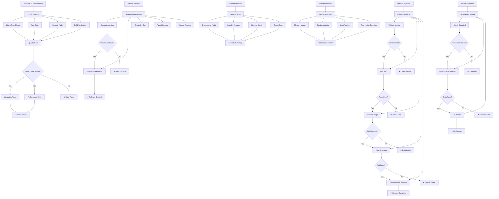
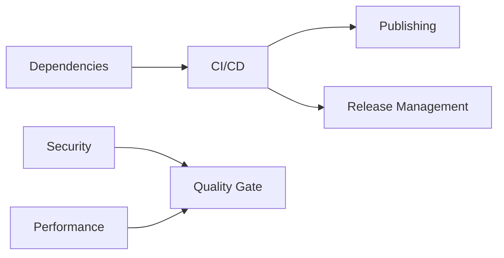

# GitHub Actions Workflow Diagram

## Workflow Overview

## Workflow Triggers

### CI/CD Pipeline
- **Trigger**: Push/PR to main/develop
- **Purpose**: Validate code quality and functionality
- **Jobs**: Lint, Test, Security, Build, Integration, Performance

### Publishing
- **Trigger**: Version tag push (v*)
- **Purpose**: Publish package to npm
- **Jobs**: Validate, Test, Build, Publish, Release

### Release Management
- **Trigger**: Manual dispatch
- **Purpose**: Create new releases
- **Jobs**: Version bump, Tag creation, Release creation

### Security Scanning
- **Trigger**: Schedule (daily), Push/PR, Manual
- **Purpose**: Security vulnerability detection
- **Jobs**: Dependency audit, CodeQL, License check, Secret scan

### Performance Testing
- **Trigger**: Schedule (weekly), Push/PR, Manual
- **Purpose**: Performance monitoring
- **Jobs**: Memory usage, Bundle analysis, Load testing

### Dependency Updates
- **Trigger**: Schedule (weekly), Manual
- **Purpose**: Keep dependencies updated
- **Jobs**: Check outdated, Update dependencies, Create PR

## Environment Requirements

### Required Secrets
- `NPM_TOKEN` - npm publishing token
- `GITHUB_TOKEN` - GitHub API access (auto-provided)
- `WOPEE_API_KEY_TEST` - Test API key (optional)
- `WOPEE_PROJECT_UUID_TEST` - Test project UUID (optional)

### Environment Variables
- `NODE_VERSION: '18'`
- `NPM_VERSION: '8'`
- `REGISTRY_URL: 'https://registry.npmjs.org/'`

## Workflow Dependencies

## Success Criteria

### CI/CD Pipeline
- ✅ All linting passes
- ✅ All tests pass
- ✅ Security audit passes
- ✅ Build succeeds
- ✅ Quality gate passes

### Publishing
- ✅ Version validation passes
- ✅ Tests pass
- ✅ Build succeeds
- ✅ npm publish succeeds
- ✅ GitHub release created

### Security
- ✅ No critical vulnerabilities
- ✅ CodeQL analysis passes
- ✅ License compliance
- ✅ No secrets detected

### Performance
- ✅ Memory usage within limits
- ✅ Bundle size within limits
- ✅ No performance regressions
- ✅ Load tests pass

## Failure Handling

### Automatic Retry
- Network failures: 3 retries with exponential backoff
- Transient errors: Automatic retry
- Rate limiting: Wait and retry

### Manual Intervention
- Critical failures: Manual review required
- Security issues: Immediate notification
- Performance regressions: Alert and investigation

### Rollback Procedures
- Failed publishes: Version rollback
- Broken releases: Tag deletion
- Security issues: Immediate patching
